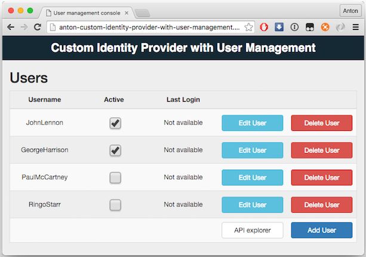

# Custom Identity Provider with User Management

This repository contains an advanced sample of Custom Identity Provider to be used with [Mobile Client Access service](https://console.ng.bluemix.net/docs/services/mobileaccess/overview.html) for IBM Bluemix. 

The Mobile Client Access service allows to create a custom identity provider and implement your own authentication logic of collecting and validating credentials. A custom identity provider is a web application that exposes a RESTful interface. You can host custom identity provider on premises or on IBM Bluemix. The only requirement is that the custom identity provider must be accessible from the public internet so that it can communicate with the Mobile Client Access service.



> IMPORTANT - Please note that while being a rather advanced this sample is not intended for production use as-is. The goals of this sample is to demonstrate a complex usecase implementation and serve as a basis for real production implementations. 

## Before we begin

The following instructions assume that you're familiar with Mobile Client Access service and Custom Identity Provider interface. In order to get more information regarding these topics please use below links

* [Mobile Client Access overview](https://console.ng.bluemix.net/docs/services/mobileaccess/overview.html)
* [Getting Started with Mobile Client Access](https://console.ng.bluemix.net/docs/services/mobileaccess/getting-started.html)
* [Protecting cloud resources](https://console.ng.bluemix.net/docs/services/mobileaccess/protecting-resources.html)
* [Custom authentication overview](https://console.ng.bluemix.net/docs/services/mobileaccess/custom-auth.html)
* [A custom identity provider interface](https://console.ng.bluemix.net/docs/services/mobileaccess/custom-auth-identity-provider.html)

## Running this sample on IBM Bluemix

This sample has three components

* REST API for administrative login and user management
* Web based console for administrative login and user management
* REST API implementing the Custom Identity Provider interface

The sample is built as a Node.js application using technologies like Swagger, Expressjs, Passportjs etc. In order to run it on Bluemix you will need to have an IBM Bluemix account and CF toolchain installed. 

> [Sign up for IBM Bluemix](https://console.ng.bluemix.net/registration)

> [Login to IBM Bluemix](https://console.ng.bluemix.net/login)

> [Install and learn how to use CloudFoundry CLI](https://github.com/cloudfoundry/cli)

1. Start by cloning this sample to your local development environment.

	```
	git clone https://github.com/ibm-bluemix-mobile-services/bms-mca-custom-identity-provider-with-user-management.git
	```
	> CloudFoundry applications are stateless in their nature and do not store any data locally. This sample supports two types of user database persistence - using in-memory database, that will be cleaned up every time application is restarted, and using Cloudant NoSQL DB. 

1. Update `manifest.yml` file, change the `host` and `name` properties. The `host` property defines your application host once it will be deployed to Bluemix, therefore it must be globally unique. The `name` property defines the application name in your current space. 

1. Update `ADMIN_USERNAME` and `ADMIN_PASSWORD` environment variables in `manifest.yml` file. These would be your login credentials to the user management console. 

1. The default user database persistence mode is in-memory database. It does not require any additional setup, however all the data will be erased once application is restarted. As described above, alternatively it is possible to configure Cloudant NoSQL DB to serve as a user database persistence layer. In order to use CloudantNoSQL DB uncomment four CLOUDANT environment variables in `manifest.yml` file and set the respective values. 

1. Use `cf push` command to deploy your app to Bluemix. 

1. Application deploy might take couple of minutes. Once application is successfully deployed you will see the url which application can be accessed by. The url is comprised of the `host` property you've defined in `manifest.yml` and `mybluemix.net` domain, e.g. 

	> `https://my-custom-identity-provider.mybluemix.net`
	
1.  Try browsing to the url of your custom identity provider in your desktop browser. You will see a login screen with username and password prompt. Use the credentials you've defined previously in `ADMIN_USERNAME` and `ADMIN_PASSWORD` environment variables in `manifest.yml` file to login. 

1. Use the user management console to add, update and delete users. 

1. Click the `API Explorer` button to see Swagger doc for this sample 

## Configuring Mobile Client Access service 

1. To configure your Mobile Client Access service to use a newly deployed Custom Identity Provider. Open the Mobile Client Access Dashboard and enable Custom Authentication. 

1. Use any alphanumerical string as `Realm name`. Keep a note of `Realm name`, you will need it to configure authentication in the Mobile Client Access SDK later. 
 
1. The URL of your new Custom Identity Provider that you need to set in the Mobile Client Access Dashboard is `https://{your-application-hostname}/api/custom-identity-provider/v1/`, e.g.:

	```
	https://johns-identity-provider.mybluemix.net/api/custom-identity-provider/v1/
	```


> For more details about configuring Mobile Client Access service and mobile apps to use Custom Identity Providers and read [this documentation article. ](https://console.ng.bluemix.net/docs/services/mobileaccess/custom-auth-config-mca.html)
	

# License
=======================

Copyright 2016 IBM Corp.

Licensed under the Apache License, Version 2.0 (the "License"); you may not use this file except in compliance with the License. 


You may obtain a copy of the License at [http://www.apache.org/licenses/LICENSE-2.0](http://www.apache.org/licenses/LICENSE-2.0)

Unless required by applicable law or agreed to in writing, software distributed under the License is distributed on an "AS IS" BASIS, WITHOUT WARRANTIES OR CONDITIONS OF ANY KIND, either express or implied. See the License for the specific language governing permissions and limitations under the License.


